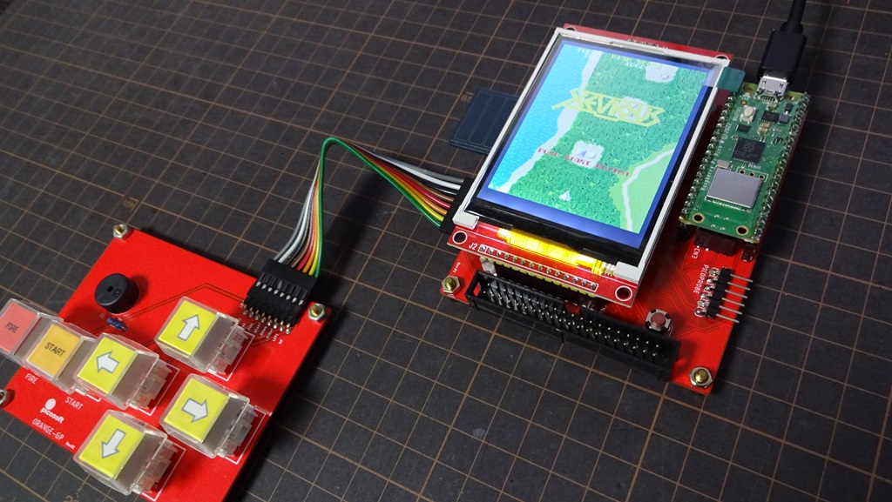
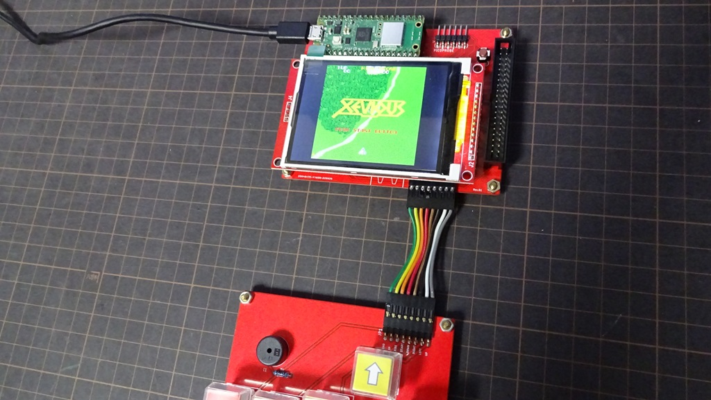

# MachiKania type P Pico Xeviousもどき  
Katsumi様、KenKen様作成の[MachiKania type M](http://www.ze.em-net.ne.jp/~kenken/machikania/typem.html)用に作成した「Xeviousもどき」を  
Raspberry Pi Picoへ移植し [MachiKania type P](http://www.ze.em-net.ne.jp/~kenken/machikania/typep.html)に対応しました。    
 
VERTICALバージョン  
  
HORIZONTALバージョン  
  

　液晶接続など使用ポートはMachiKania type Pと同様です。  
　「MACHIKAP.INI」に「LCD180TURN」と記載すると表示を180度反転します。  
　　又「ROTATEBUTTONS」を記載すると上下左右ボタンを入れ替ます。  

　uf2フォルダー内のファイルを参照ください。  
　　「HORIZONTAL」,「VERTICAL」フォルダー内の「pico」、「pico2」に  
　　それぞれ「Normal」音声と「PWM」音声（外部アンプ要）を保存しました。  

　　※pico2対応版を追加しました。（2024/10/28）  
　　※USBKeyBoadに対応しました。（2025/06/15）  
 　　　キー操作はphyllosoma_Pに準拠、FIREキーはZキー、STARTキーはXキーを追加
